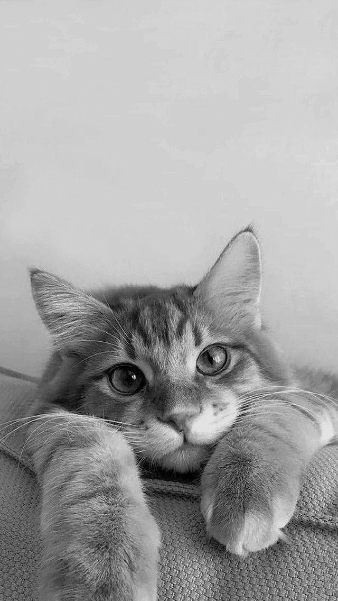
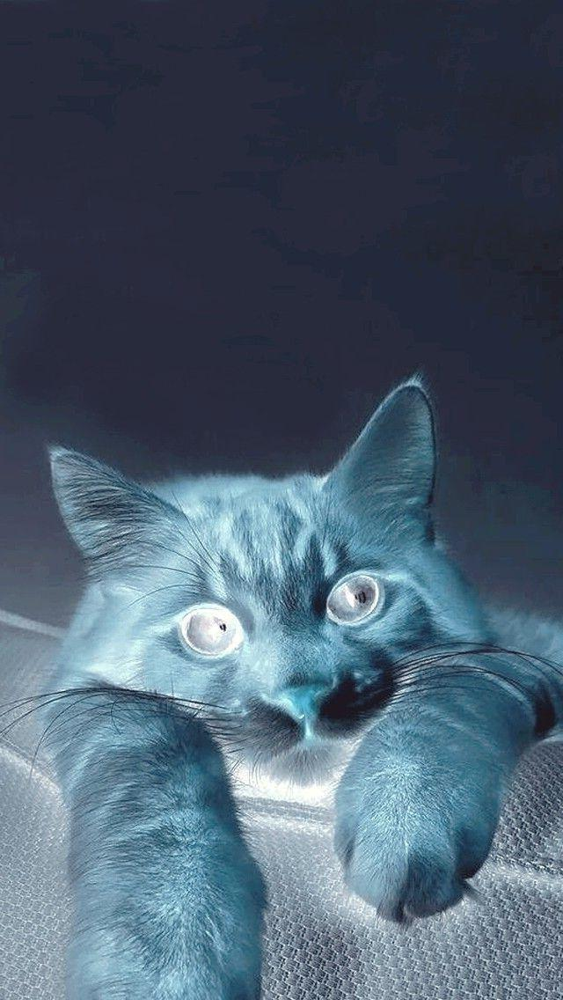
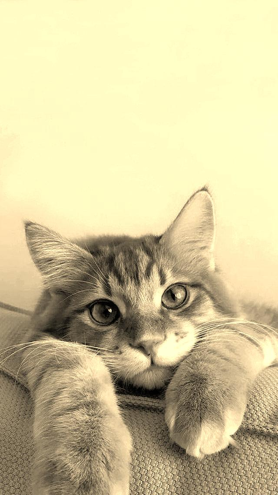
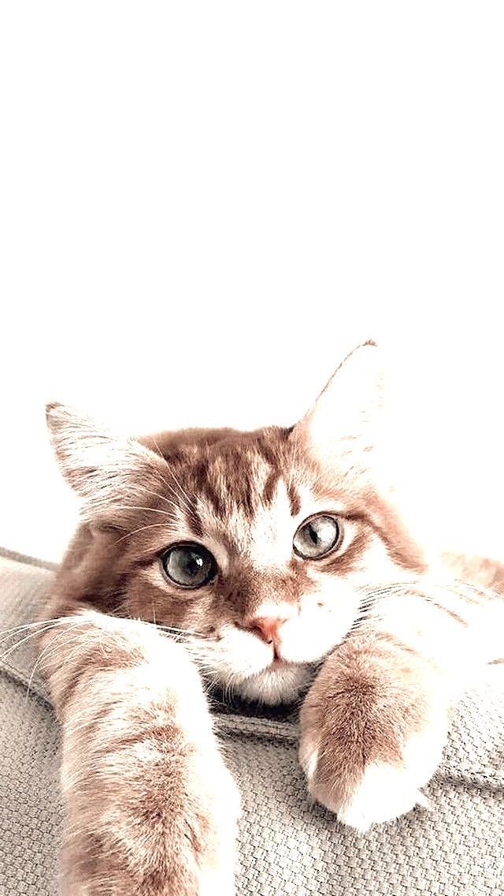
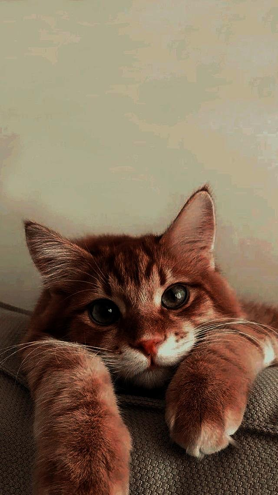
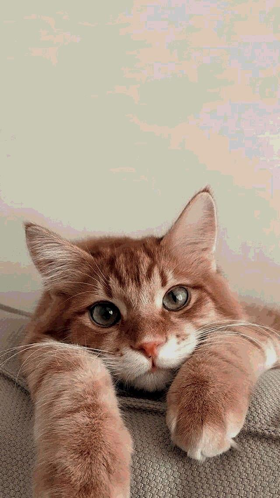

# Image transformation minute project
Here are the results of applying the transformations to an example image:

### Original Image

### 1. Grayscale Conversion

### 2. Color Inversion

### 3. Sepia Tone

### 4. Brightness Adjustment

### 5. Gamma Correction

### 6. Posterization

# Formulas
Here are some formulas:

### 1. Grayscale conversion: 
    New R = (R + G + B)/3
    New G = (R + G + B)/3
    New B = (R + G + B)/3
### 2. Color inversion: 
    New R = 255 - R
    New G = 255 - G
    New B = 255 - B
### 3. Sepia tone:
    New R = 0.393R + 0.769G + 0.189B
    New G = 0.349R + 0.686G + 0.168B
    New B = 0.272R + 0.534G + 0.131B
### 4. Brightness adjustment:
    New R = R + B
    New G = G + B
    New B = B + B
### 5. Gamma correction:
    New R = 255 * (R / 255) ^ gamma
    New G = 255 * (G / 255) ^ gamma
    New B = 255 * (B / 255) ^ gamma
### 6. Posterization:
    New R = (R / levels) * levels
    New G = (G / levels) * levels
    New B = (B / levels) * levels